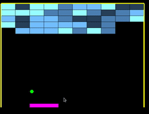


#Demo

#Requriments

(assuming you have g++ installed else please get that too)

    sudo apt-get install freeglut3-dev
    
    sudo apt-get install libglew-dev
    
    sudo apt-get install libglfw3 libglfw3-dev
    
      

  

#To execute:

    $make all
    
    $./glutitout

  
  
  
  

##Here are some common bugs that you may run into:

Application crashes at glutInitContextVersion( 2, 1 ); with error glXCreateContextAttribsARB not found - This means your GPU does not support the glXCreateContextAttribsARB OpenGL extension. This also means your GPU does not support OpenGL 3.0 and later. For now, comment glutInitContextVersion( 2, 1 ); out. When we get to the GLEW and Extensions tutorials, we'll cover OpenGL extended functionality.
